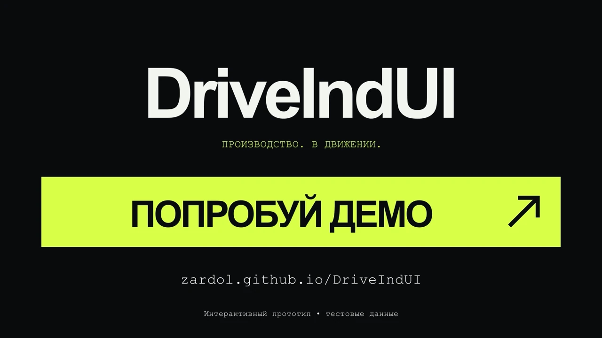

# DriveIndUI — Drive Industrial UI

Интерактивный прототип цифрового двойника автомобильного производства для кейса Allur на Qostanai Industry Hackathon. Помогает контролировать выполнение плана, находить узкие места и оценивать решения до изменения работы линии.

**[Открыть демо](https://zardol.github.io/DriveIndUI/)**

## Трейлер

24 секунды · 1080p · **[Смотреть трейлер](https://zardol.github.io/DriveIndUI/media/driveindui-trailer.mp4)**

[Скачать MP4](https://raw.githubusercontent.com/zardol/DriveIndUI/main/apps/web/public/media/driveindui-trailer.mp4)

## Возможности по ТЗ

- **Визуализация производства:** 3D-цех и 2D-схема, оборудование, движение каждого автомобиля и очереди на конвейере.
- **Контроль показателей:** выпуск, загрузка, простои, качество и отклонения от плана.
- **Производственный план:** месячные заказы Onix, Cobalt и J7, сменные квоты и выпуск по моделям.
- **Инциденты:** журнал остановок и отображение их влияния на производственный поток.
- **Управленческие решения:** сравнение продолжения работы, обслуживания окраски и увеличения мощности сборки по выпуску и простоям.
- **ИИ-анализ:** оценка рисков простоев и узких мест через OpenAI с объяснением причин и рекомендациями.

## Данные и границы прототипа

Использованы тестовые данные организатора: работа линий и качество за 1–2 октября, четыре остановки оборудования и месячный производственный план. В заказах распределено **4 800 из 5 500 автомобилей**; оставшиеся **700** показаны отдельно и не создаются в симуляции без назначения модели.

Исходные показатели отделены от расчётов. Прототип не подключён к оборудованию завода; планировка и часть параметров модели условны. ИИ помогает интерпретировать риски, но не является обученной и проверенной на заводских данных моделью отказов.

Потенциальный эффект оценивается через изменение выпуска и простоя в сценариях и возможности снижения брака. Денежный эффект не рассчитывается: необходимых исходных данных нет.

## Материалы проекта

- [Соответствие ТЗ, исходные данные и ограничения](docs/CASE-DATA.md)
- [Архитектура решения](docs/ARCHITECTURE.md)
- [Сценарий демонстрации](docs/DEMO.md)
- [Устройство и настройка ИИ-анализа](docs/AI.md)
