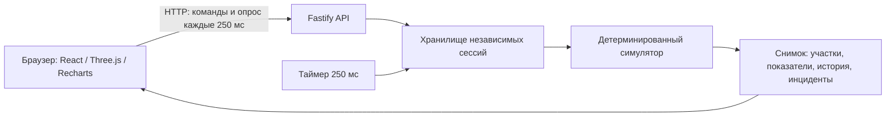

# Архитектура прототипа

## Ответственность модулей

Симулятор не знает о сети, браузере или реальном времени. Сервер переводит прошедшие реальные миллисекунды в целые модельные секунды с учётом скорости. Интерфейс отображает полученное состояние; вычислять собственные производственные показатели или случайные инциденты ему не требуется.

Каждая новая сессия использует seed 42, сценарий `normal`, скорость 60 и включённое воспроизведение. Старт модели соответствует 08:00 условной восьмичасовой смены. Число изделий сохраняется: поступившие изделия равны сумме годного выпуска, брака и незавершённого производства.

## HTTP API

| Метод и путь | Тело | Ответ |
| --- | --- | --- |
| `GET /api/health` | — | Состояние сервиса и признак синтетических данных |
| `POST /api/sessions` | `{}` | `201 SessionSnapshot` |
| `GET /api/sessions/:id` | — | `200 SessionSnapshot` |
| `POST /api/sessions/:id/control` | `ControlCommand` | `200 SessionSnapshot` |
| `POST /api/sessions/:id/comparison` | `{maintenanceMinutes:10,reserveSetupMinutes:5}` | `200 SessionComparison` |

Команды: `{action:"play"}`, `{action:"pause"}`, `{action:"reset"}`, `{action:"setSpeed",speed:1\|10\|60}`, `{action:"setScenario",scenario:"normal"\|"equipment"\|"bottleneck"}`. Это обозначение вариантов, а не буквальный JSON с вертикальными чертами.

Типы находятся в `packages/shared/src/index.ts`. Все длительности модели передаются в секундах; загрузка и качество — в процентах. `qualityPercent: null` означает отсутствие завершённых изделий. `downtimeSeconds` завода — сумма механических простоев оборудования, а не длительность остановки всего завода. Ожидание деталей и блокировка очереди механическим простоем не считаются.

Ошибки имеют форму `{error, message}`: 400 для некорректной команды, 404 для отсутствующей или истёкшей сессии, 503 при достижении лимита сессий. Снимки не кэшируются. Идентификатор сессии непредсказуемый; полноценная система пользователей в демонстрацию не входит.

## Браузерный режим публичного стенда

Сборка `vite build --mode demo` устанавливает `VITE_SIMULATION_MODE=browser` и создаёт `dist/demo`. Транспорт `api.ts` вызывает `BrowserSession`, который использует существующий `@driveindui/simulation`; HTTP API не требуется. Серверная сборка по-прежнему использует Fastify. Случайные отказы и производственные расчёты не дублируются в интерфейсе.

Браузерная сессия использует монотонные часы `performance.now()` и переводит время в целые модельные секунды с остатком. Один промежуток ограничен пятью реальными секундами. Полная траектория каждого сценария проверяется на совпадение со снимками исходного движка. Вкладки независимы; перезагрузка создаёт новую смену. Фоновые ограничения браузера могут замедлять симуляцию.

График и 3D-цех загружаются отдельными JS-модулями. Все ресурсы локальные, внешние шрифты и CDN не используются.

## Трёхмерный цех

`FactoryView` переключает Three.js / React Three Fiber и резервную SVG-схему. Обе получают один снимок симулятора: статусы, прогресс обработки, очереди и выпуск. Отрисовка не создаёт изделий и не изменяет расчёты. Геометрия оборудования процедурная, условная; она не воспроизводит ещё не полученную планировку Allur.

Все активные автомобили отображаются по постоянным ID, включая подъезд, очередь, обработку и выход. Части автомобилей объединены по материалам и используют instancing. Камера может следить за выбранной машиной; полный список ID позволяет проверить число машин в линии. Между снимками интерполируется только подтверждённый пройденный путь, без прогнозирования движения. Пауза останавливает машины и механизмы; reduced motion оставляет обновление показателей без непрерывной анимации. В скрытой вкладке и вне видимой области кадры не рисуются. Экономный режим отключает тени и ограничивает разрешение. При ошибке WebGL открывается 2D-схема.

Локальный JSON описывает пол, координаты и повороты четырёх существующих участков. Парсер проверяет поля, границы, уникальность и пересечения оборудования. Построитель прокладывает непрерывный маршрут с закруглёнными поворотами и отклоняет самопересечения или выход за границы пола; ошибочный файл не заменяет текущую схему. Загрузка меняет только геометрию и не отправляет файл на сервер. При перезагрузке страницы восстанавливается учебная схема. Формат и подготовка реальных данных описаны в `DATA-INTEGRATION.md`.

## Накопительный конвейер

Движок хранит каждую машину: ID, серийный номер, координату вдоль линии, целевую операцию, состояние и результат контроля качества. Логический путь имеет длину 200 условных единиц, посты находятся на 40/80/120/160, свободная скорость по умолчанию — 0,5 единицы в модельную секунду, минимальный шаг между машинами — 4. Эти величины учебные и не считаются метрами реального завода. Изменение визуальной планировки не калибрует транспортную скорость.

Обработка начинается только после прибытия к посту. Занятый или остановленный пост удерживает машину; следующие накапливаются за ней без обгона. Входной буфер каждого участка по умолчанию вмещает восемь машин и включает движущиеся (`arrivingUnits`) и ожидающие (`queuedUnits`) изделия. Обрабатываемая машина учитывается отдельно. Готовая операция блокируется при заполнении следующего буфера или отсутствии места для движения. По умолчанию подача происходит раз в 240 секунд при свободном буфере и свободном входе.

Результат качества определяется один раз при освобождении последнего поста. Годный выпуск и брак увеличиваются лишь после достижения выхода на координате 200. Поэтому `wip = conveyor.vehicles.length = introducedUnits - goodUnits - rejectedUnits` включает автомобили между контролем и выходом. Полные смены проверяются на сохранение изделий, расстояние между машинами, воспроизводимость и ограниченные буферы. Анимация роликов показывает накопительные зоны; динамика жёстких тел, столкновения и реальные приводы не моделируются.

## Сравнение решений

`compareEngine` копирует точное состояние движка, включая незавершённую обработку, очереди, генератор случайных чисел и журнал. Три независимых ветви продолжаются до конца смены. Базовая ветвь сохраняет события; обслуживание останавливает окраску на 5/10/15/20 минут и устраняет оставшиеся отказы этого участка; резерв останавливает сборку на 0/5/10/15 минут и удваивает её скорость обработки. Резерв — агрегированная модель мощности, а не два параллельных поста.

`revision` увеличивается при сбросе, смене сценария и применении конфигурации. Результат содержит идентификатор сессии, ревизию и время начала расчёта. Сброс размонтирует панель, отменяет запрос и удаляет старые результаты. Изменение скорости и пауза не обесценивают уже рассчитанную ветвь; движение времени также не переписывает её начальный момент.

В браузерном режиме `BrowserSession.fork()` передаёт копию в отдельный модульный Web Worker. Завершение, отмена, ошибка и таймаут освобождают Worker. API не вызывается. В серверном режиме сравнение выполняется над копией после обычного обновления сессии по часам. Параметры проверяются на обеих границах: HTTP и вычислительная функция.

Сценарный расчёт знает расписание событий, в отличие от простой экстраполяции по среднему темпу. Результат воспроизводим при одинаковом состоянии и параметрах; это не оценка точности на реальных данных. Простой включает моделируемые остановки обслуживания и переналадки и суммируется по оборудованию. Финансовые затраты не моделируются.

## Конфигурация и исторические записи

`packages/shared/src/production.ts` содержит `ProductionConfig`, единый валидатор JSON и парсер нормализованного CSV. `EngineOptions.config` проходит проверку и получает независимую копию. `PlantSnapshot.config` также отделён от состояния движка. Параметры станций объединяются с описаниями по каноническим ID; логическая топология и минимальное расстояние остаются фиксированными.

Команда `{action:"setConfiguration",config:ProductionConfig}` проверяется HTTP-слоем и движком. Новая смена сначала создаётся целиком, затем заменяет прежнюю и ставится на паузу. `reset` и `setScenario` передают активную конфигурацию; сравнение клонирует её вместе с состоянием. Горизонт, план и подписи допущений берутся из конфигурации.

`DataWorkspace` читает файлы UTF-8, показывает диагностику и предпросмотр JSON перед применением. `HistoricalViewer` получает только прошедшие проверку записи; он не использует `PlantSnapshot`, симулятор или API. Воспроизведение идёт по исходным строкам, без реконструкции траекторий и заполнения пропусков. CSV хранится только в React-состоянии вкладки. При переключении режимов 3D остаётся смонтированным, поэтому загруженная планировка сохраняется; анимация и расчёт ставятся на паузу.

Диапазоны, определения и ограничения файлов описаны в [DATA-INTEGRATION.md](DATA-INTEGRATION.md). Параметры с пометкой `provided` не считаются подтверждёнными измерениями. Импорт производственных Excel/CSV в неизвестном заранее формате остаётся задачей адаптации после получения исходников.

## Следующие шаги

Приоритет следующего этапа — данные 5 октября, проверка соответствия модели реальному процессу и калибровка. Затем ИИ-помощник сможет объяснять готовые расчёты; ключ API останется на сервере.

При получении настоящих данных понадобится отдельный адаптер к общему формату и проверка качества данных. Синтетические сценарии не подтверждают точность прогноза на реальном оборудовании.
